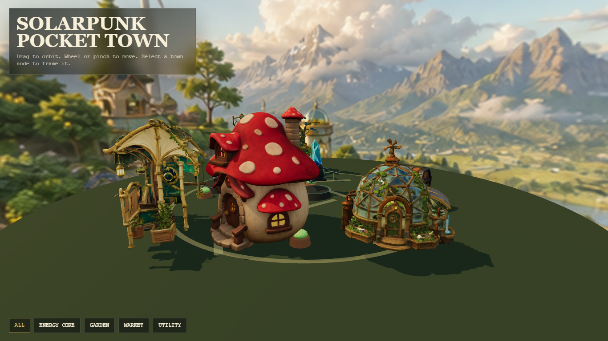

<div align="center">

# Dockerized Pixal3D Solarpunk Pocket Town

画像生成したゲーム用アセットをPixal3DでGLB化し、Three.jsで小さなソーラーパンク町として配置したデモです。

[English](README.md) · [Pixal3D公式プロジェクト](https://ldyang694.github.io/projects/pixal3d/) · [Pixal3D Models](https://huggingface.co/TencentARC/Pixal3D)

</div>



## ✨ このリポジトリについて

このリポジトリは Tencent ARC の Pixal3D コードベースをもとにした、公開用デモプロジェクトです。

- Windows/WSL2/Linux + NVIDIA GPU 向け Docker Compose 一式
- Hugging Face / Torch / XDG のホスト共有キャッシュ
- 生成済み8個のGLBアセット
- 元GLBを上書きしない姿勢補正版 `*_tilt_corrected.glb`
- `outputs/generated_game_assets/gallery.html` のThree.js町ビューア
- このPCで動かすために入れたPixal3D互換パッチ

元のPixal3Dのライセンス、出典、citationは維持しています。このリポジトリでは、ソーラーパンク町デモとDocker運用まわりを追加しています。

## 🏙️ デモ内容

| アセット | 入力画像 | 3D出力 |
|---|---|---|
| マナクリスタル / エネルギー核 | `assets/generated_game_assets/mana_crystal_alpha.png` | `outputs/generated_game_assets/models/original/mana_crystal.glb` |
| 宝箱 / 保管庫 | `assets/generated_game_assets/treasure_chest_alpha.png` | `outputs/generated_game_assets/models/original/treasure_chest.glb` |
| エネルギータレット / ユーティリティ設備 | `assets/generated_game_assets/energy_turret_alpha.png` | `outputs/generated_game_assets/models/original/energy_turret.glb` |
| キノコ家 | `assets/generated_game_assets/mushroom_house_alpha.png` | `outputs/generated_game_assets/models/original/mushroom_house.glb` |
| ソーラーツリー | `outputs/generated_game_assets/images/sources/solar_tree.png` | `outputs/generated_game_assets/models/original/solar_tree.glb` |
| 温室ドーム | `outputs/generated_game_assets/images/sources/greenhouse_dome.png` | `outputs/generated_game_assets/models/original/greenhouse_dome.glb` |
| 風力ポッド | `outputs/generated_game_assets/images/sources/wind_pod.png` | `outputs/generated_game_assets/models/original/wind_pod.glb` |
| マーケット屋台 | `outputs/generated_game_assets/images/sources/market_stall.png` | `outputs/generated_game_assets/models/original/market_stall.glb` |

ビューアでは `*_tilt_corrected.glb` を参照しています。元のGLBは比較・戻し用にそのまま残しています。

## 🚀 起動方法

### 1. 前提

- Windows + WSL2 + Docker Desktop、またはLinux + Docker Engine
- DockerからNVIDIA GPUが使えること
- CUDA/PyTorch/Pixal3D/TRELLISのモデルキャッシュを置けるディスク容量
- `PIXAL3D_SKIP_REMBG=0` で背景除去を使う場合は、Hugging Faceのgated modelへアクセスできること

### 2. Pixal3Dイメージをビルド

```powershell
docker compose build pixal3d
```

### 3. 町ビューアを起動

```powershell
docker compose up viewer
```

ブラウザで開きます。

```text
http://127.0.0.1:8787/gallery.html
```

### 4. 画像をGLB化

```powershell
$env:PIXAL3D_INPUT='outputs/generated_game_assets/images/sources/solar_tree.png'
$env:PIXAL3D_OUTPUT='outputs/generated_game_assets/models/original/solar_tree.glb'
$env:PIXAL3D_FOV='0.2'
docker compose run --rm pixal3d
```

背景除去済みのRGBA画像なら、背景除去をスキップできます。

```powershell
$env:PIXAL3D_SKIP_REMBG='1'
docker compose run --rm pixal3d
Remove-Item Env:PIXAL3D_SKIP_REMBG
```

### 5. Gradioアプリを起動

```powershell
docker compose --profile app up app
```

```text
http://127.0.0.1:7860
```

## 🧠 モデルキャッシュ

Composeでは以下をホスト共有キャッシュとして使います。

```text
.cache/huggingface -> /workspace/.cache/huggingface
.cache/torch       -> /workspace/.cache/torch
.cache/xdg         -> /workspace/.cache/xdg
```

`.cache/` はGit管理外です。モデル本体やHugging Face認証情報を公開リポジトリに入れないでください。

## ⚠️ 公開前の注意

現在のGit remoteが元のPixal3Dリポジトリを指している場合があります。公開する前に、自分の新規リポジトリへ向け直してください。

```powershell
git remote remove origin
git remote add origin https://github.com/<your-user>/<your-repo>.git
git push -u origin master
```

## 📄 出典

このプロジェクトは以下をベースにしています。

- [TencentARC/Pixal3D](https://github.com/TencentARC/Pixal3D)
- [microsoft/TRELLIS.2](https://github.com/microsoft/TRELLIS.2)

Pixal3Dの研究コードを利用する場合は、元論文のcitationを参照してください。
